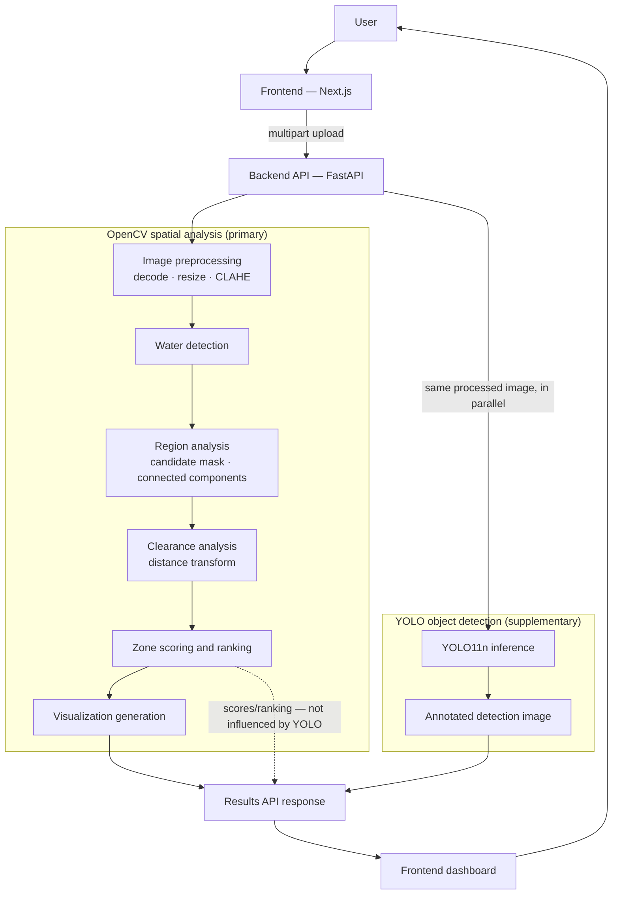

# AASRA — AI-Assisted Relief Area Identification

**AASRA is an image-based decision-support prototype for aerial flood imagery.**
Given a single aerial or drone photo of a flooded area, it estimates water
coverage and ranks candidate relief zones — land areas that are dry, large
enough, and clear of detected water — each with a suggested drop point. A
supplementary object-detection pass reports visible people and vehicles as
extra context, entirely separate from the ranking.

AASRA does **not** detect flood victims, does not assess rescue or landing
safety, and does not make any operational decision. It surfaces measurements
and candidates for a human to verify. See [Limitations](#limitations) and the
[Disclaimer](#disclaimer) below.

---

## Table of contents

- [The problem](#the-problem)
- [What the system does](#what-the-system-does)
- [Features](#features)
- [How it works](#how-it-works)
- [System architecture](#system-architecture)
- [Technology stack](#technology-stack)
- [Project structure](#project-structure)
- [Getting started](#getting-started)
  - [Backend setup](#backend-setup)
  - [Frontend setup](#frontend-setup)
  - [Running both together](#running-both-together)
- [API overview](#api-overview)
- [Input / output](#input--output)
- [Deployment](#deployment)
- [Limitations](#limitations)
- [Disclaimer](#disclaimer)
- [License](#license)

---

## The problem

After a flood, aerial or drone imagery is often the fastest way to see the
extent of the water and what land is still usable — before roads are passable
or ground teams can survey the area. Reading that imagery by eye, at scale, is
slow and inconsistent. AASRA explores whether a lightweight computer-vision
pipeline can turn a single photo into a structured, ranked shortlist of
candidate areas for a human responder to check first, without requiring any
specialised sensors, GPS metadata, or training data.

## What the system does

1. Accepts one uploaded aerial/drone image (JPG or PNG).
2. Detects likely water coverage using a multi-cue OpenCV heuristic (not a
   trained model).
3. Finds non-water land regions, measures their distance from water and their
   internal open space, and scores/ranks them as candidate relief zones.
4. Computes a candidate drop point inside each ranked zone.
5. Optionally runs a small YOLO object detector over the same image to report
   visible people and vehicles, purely as supplementary context.
6. Returns all of this — numbers, rankings and annotated images — as JSON to
   a Next.js dashboard.

## Features

- Aerial image upload with client-side and server-side validation (type,
  size, decodability).
- Water coverage estimation as a percentage of the processed image.
- Non-water / candidate-area spatial analysis (connected components outside
  a water safety buffer).
- Candidate region detection with minimum-area and minimum-clearance
  filtering.
- Per-region clearance calculation: distance from the nearest detected water,
  and internal clearance from the region's own edge.
- Transparent 0–100 relief-zone scoring (area, water clearance, openness) and
  ranking, with the formula and weights exposed in the API response.
- Candidate drop-point generation for each ranked zone (the point of maximum
  clearance inside it).
- A multi-tab image viewer: Original, Water Analysis, Candidate Areas, Final
  Result, and (when available) AI Context.
- A clean "Final Result" composite: detected water, ranked zone outlines, and
  drop-point markers — no debug clutter.
- Supplementary YOLO11n object detection for **person, car, truck, bus, boat,
  motorcycle, bicycle**, with per-class counts and an annotated image.
- Graceful AI failure handling: if the object-detection model can't load or
  run, the response reports `analysis_mode.ai = false` and the rest of the
  analysis is returned unaffected.
- Responsive frontend (desktop, tablet, mobile) with no mock data — every
  number on screen comes from the live backend response.

The backend also computes potentially isolated land regions (land
disconnected from the main landmass by water) and returns them in the API for
completeness, but the current dashboard does not display this section — the
UI's focus is the ranked relief zones.

## How it works

1. The user uploads an aerial flood image through the web UI.
2. The backend decodes it, validates it, and resizes it to a bounded working
   resolution.
3. OpenCV's water-detection heuristic classifies pixels as water using colour
   cues (blue, turbid/muddy, dark, low-saturation) combined with texture and
   edge-density support cues, then cleans up the result with morphology and
   region-level checks.
4. A pixel buffer is grown outward from detected water, and connected
   components of the remaining land are found — these are the candidate
   regions.
5. For each candidate region, a distance transform gives its internal
   clearance and its clearance from the nearest water pixel.
6. Each region is scored 0–100 from a weighted combination of area, water
   clearance and openness, then ranked; the top few are kept as relief zones.
7. A drop point (the region's point of maximum internal clearance) is
   computed for each ranked zone.
8. Independently, a YOLO11n object detector runs once over the same image to
   report visible people/vehicles — this never feeds back into steps 3–7.
9. The backend returns metrics, ranked zones, the YOLO detections, and a set
   of annotated PNG visualizations as one JSON response, which the frontend
   renders.

## System architecture



**Key point:** YOLO detection results are attached to the response
independently. They are never read by, or fed into, the water-detection,
region-analysis, clearance or scoring stages. If the YOLO model fails to load
or errors during inference, the OpenCV pipeline still completes normally and
the response simply reports `analysis_mode.ai = false`.

## Technology stack

**Backend**

| Component | Version (pinned) |
|---|---|
| Python | 3.13 |
| FastAPI | 0.115.6 |
| Uvicorn | 0.34.0 |
| OpenCV (`opencv-python`) | 4.10.0.84 |
| NumPy | 2.1.3 |
| Pillow | 11.0.0 |
| PyTorch | 2.6.0 (CPU) |
| Torchvision | 0.21.0 (CPU) |
| Ultralytics (YOLO11n) | 8.3.253 |

PyTorch/Torchvision/Ultralytics back the *supplementary* YOLO object-detection
service only. The core water/region/scoring pipeline is pure OpenCV + NumPy
and has no ML dependency.

**Frontend**

| Component | Version |
|---|---|
| Next.js | 16.3.5 (App Router) |
| React | 19.2.8 |
| TypeScript | ^5 |
| Tailwind CSS | ^4 |
| lucide-react | ^1.45.0 |

No other UI framework, state-management library, or charting library is used.

## Project structure

```
AASRA/
├── backend/
│   ├── app/
│   │   ├── main.py                 FastAPI app: GET /health, POST /api/analyze
│   │   ├── config.py                every tunable threshold, documented inline
│   │   ├── pipeline.py              orchestrates the phases, builds the JSON response
│   │   └── services/
│   │       ├── preprocessing.py         decode, resize, analysis copy (blur + CLAHE)
│   │       ├── water_detection.py       multi-cue floodwater heuristic
│   │       ├── drop_zone_detection.py   water buffer + candidate mask
│   │       ├── region_analysis.py       connected components, distance transform, openness
│   │       ├── isolated_regions.py      potentially isolated land regions (API only)
│   │       ├── scoring.py               transparent 0–100 zone scoring and ranking
│   │       ├── visualization.py         base64 PNG visualizations
│   │       └── ai_detection.py          supplementary YOLO11n object detection
│   ├── tests/
│   │   └── smoke_test.py           offline end-to-end pipeline check
│   ├── requirements.txt
│   ├── .python-version             pins Python 3.13 for local dev and Render
│   └── README.md
├── frontend/
│   ├── app/                        layout, page shell, upload/analyze/results states
│   ├── components/                 header, upload, image viewer, zone cards, AI status
│   ├── lib/                        api.ts (backend calls), format.ts, classification.ts
│   ├── types/                      TypeScript mirror of the backend response
│   └── README.md
├── docs/
│   ├── api.md                      API reference
│   ├── pipeline.md                 algorithms and formulas
│   ├── PRD.md                      product requirements document
│   └── deployment.md               Render + Vercel production-readiness notes
├── render.yaml                     Render Blueprint for the backend service
└── README.md                       this file
```

## Getting started

### Backend setup

Requires Python 3.13 (or a compatible 3.x — see [Limitations](#limitations)).

```bash
cd backend
python -m venv .venv
# Windows:    .venv\Scripts\activate
# Linux/mac:  source .venv/bin/activate
pip install -r requirements.txt
uvicorn app.main:app --reload --port 8000
```

`uvicorn` must be started from the `backend/` directory so the `app` package
resolves. On first successful `/api/analyze` request, the ~5.6 MB YOLO11n
weight file is downloaded automatically and cached under
`backend/app/services/weights/` (internet is required only for that first
download; the rest of the pipeline works fully offline).

Verify it's running:

- `GET  http://127.0.0.1:8000/health`
- Interactive API docs: `http://127.0.0.1:8000/docs`

### Frontend setup

Requires Node.js (a version compatible with Next.js 16 / React 19).

```bash
cd frontend
npm install
cp .env.example .env.local     # Windows: copy .env.example .env.local
npm run dev                    # http://localhost:3000
```

`NEXT_PUBLIC_API_URL` in `.env.local` points the frontend at the backend
(default `http://localhost:8000`). No API keys or secrets are required
anywhere in this project.

### Running both together

Run the backend and frontend commands above in two terminals. Open
`http://localhost:3000`, upload a JPG/PNG aerial flood image, and click
**Analyze imagery**.

For a backend-only check without a browser:

```bash
cd backend
python tests/smoke_test.py                    # synthetic scene
python tests/smoke_test.py path/to/real.jpg    # a real aerial image
```

This prints the metrics, ranked zones and YOLO summary, and writes every
visualization PNG to `backend/tests/output/`.

## API overview

Two endpoints, both on the FastAPI backend (default `http://localhost:8000`):

| Method | Path | Purpose |
|---|---|---|
| `GET` | `/health` | Liveness check + current configuration limits |
| `POST` | `/api/analyze` | Upload one image, get the full analysis |

`POST /api/analyze` takes a `multipart/form-data` body with a single field
named `image` (JPG, JPEG or PNG, ≤ 15 MB by default). On success (`200`) it
returns one JSON object containing, among other fields: `analysis_mode`,
`metrics`, `zones` (ranked relief zones), `isolated_regions`, `ai` (YOLO
detection summary), `images` (base64 PNG visualizations), `warnings`, and a
standing `notice`. Errors return `{ "success": false, "error": { "code",
"message" } }` and never a stack trace.

Full field-by-field reference: [`docs/api.md`](docs/api.md).
Algorithm-level detail: [`docs/pipeline.md`](docs/pipeline.md).

## Input / output

**Input:** one JPG/JPEG/PNG image, ideally a top-down or oblique aerial view
of a flooded area. There is no minimum resolution requirement beyond 64px per
side, and images are resized (longest edge to 1024px by default) before
analysis.

**Output:** a JSON response plus rendered PNG visualizations, covering:

- Water coverage and non-water area, as a percentage of the processed image.
- A ranked list of candidate relief zones, each with a 0–100 score, a
  classification band (`HIGH POTENTIAL` / `MODERATE POTENTIAL` / `LOW
  POTENTIAL` / `NOT RECOMMENDED`), pixel area, water/region clearance, a
  drop point, and the score breakdown.
- A YOLO object-detection summary: per-class counts and individual detections
  (label, confidence, bounding box) for the seven supported classes.
- Five to six annotated images (original, water mask, candidate mask, final
  result, and — when AI succeeds — the object-detection overlay).

**All pixel measurements are in the processed image's pixel space, not
real-world units.** The response includes `image_info.scale` to map back to
the original upload's coordinates if needed.

## Deployment

AASRA is intended to run as two separately deployed services: the backend on
**Render** and the frontend on **Vercel**. Both work locally with zero
configuration; deploying adds two environment variables (`CORS_ORIGINS` on
the backend, `NEXT_PUBLIC_API_URL` on the frontend) and no code changes
beyond what's already in this repository.

A Render Blueprint is included at [`render.yaml`](render.yaml). Full
production-readiness notes — dependency pinning, CORS, the YOLO weight
download, and everything else checked before deployment — are in
[`docs/deployment.md`](docs/deployment.md).

## Limitations

- This is image-based analysis only — it has no elevation, terrain, weather,
  infrastructure or historical data.
- Results depend heavily on image quality, resolution, lighting and camera
  angle; a low, oblique or hazy shot will degrade both the water detection
  and the object detection.
- Water detection is a hand-tuned computer-vision heuristic (colour + texture
  + edge cues), not a trained segmentation model — it can mistake smooth
  bare earth or dark roofs for water, and vice versa (see
  [`docs/pipeline.md`](docs/pipeline.md#known-failure-modes) for known
  failure modes).
- All pixel measurements (area, clearance, drop points) are in the
  **processed** image's pixel grid, not metres or any real-world unit.
- Zone scores are a transparent ranking heuristic over three weighted
  factors, not a validated safety or landing-suitability assessment.
- The YOLO object-detection pass is entirely supplementary: it never
  influences water detection, candidate regions, or zone scoring/ranking,
  and detecting a person or vehicle is not evidence of a flood victim, a
  stranded person, or a rescue asset.
- YOLO11n is trained on ordinary ground-level photography (COCO); its
  accuracy on aerial/top-down imagery is lower than on eye-level photos, and
  it may miss or misclassify small or unusually angled objects.
- The system has not been evaluated against a labelled flood-imagery dataset
  — there is no accuracy, precision or recall figure to quote, and none is
  claimed anywhere in this project.
- All outputs are candidates for human review, not instructions — see the
  disclaimer below.

## Disclaimer

AASRA is a prototype built for academic and decision-support purposes. It
does not detect flood victims, does not assess rescue or landing safety, and
makes no operational or safety claim of any kind. It should not be used as
the sole basis for real-world emergency, aviation, rescue or other
safety-critical decisions. Every output requires verification by trained
personnel before any action is taken on it.

## License

No license file is currently included in this repository. Until one is
added, all rights are reserved by the author; please contact the maintainer
before reusing this code.
