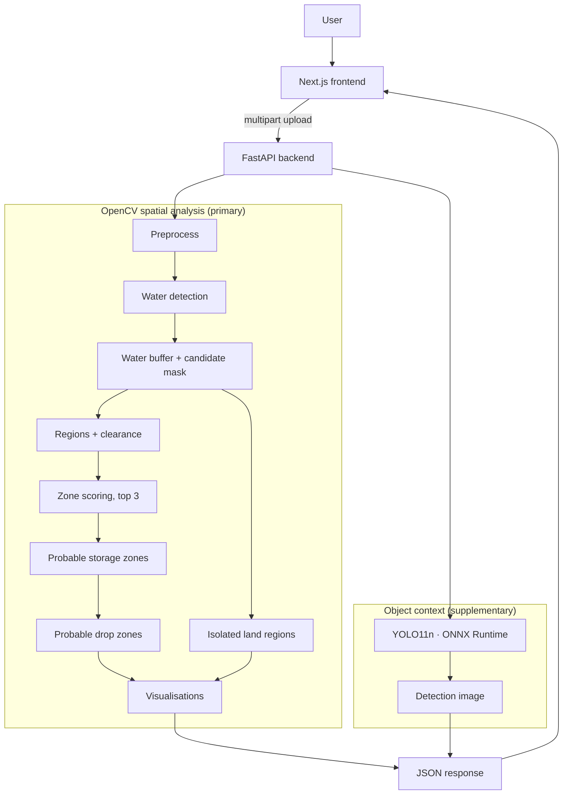

# AASRA — AI-Assisted Relief Area Identification

**Computer-vision decision support for aerial flood imagery.**
From one aerial or drone photograph, AASRA detects water, separates candidate
land, and computes **probable storage zones** and the **probable drop zones**
inside them — all as geometry measured in image pixels. A separate object
detector adds visible-object context and never changes those results.

AASRA does not detect flood victims, does not assess landing, drop, access or
structural safety, and makes no operational decision. It produces candidates
for trained people to verify. See [Limitations](#limitations).

---

## Contents

- [What it does](#what-it-does)
- [Result hierarchy](#result-hierarchy)
- [How it works](#how-it-works)
- [Architecture](#architecture)
- [Technology](#technology)
- [Project structure](#project-structure)
- [Getting started](#getting-started)
- [Testing](#testing)
- [API](#api)
- [Deployment](#deployment)
- [Limitations](#limitations)
- [Disclaimer](#disclaimer)

## What it does

1. Accepts one JPG/PNG aerial image (≤ 15 MB) and resizes it so the longest
   edge is at most 1024 px.
2. Detects water with a documented, multi-cue OpenCV heuristic (no trained
   model).
3. Widens the water by an 18 px buffer; the land that remains is candidate
   land. Connected candidate regions are measured and ranked 0–100.
4. For each of the top three regions, takes its highest-clearance pixel as
   the **storage centre** and computes the largest circle around it that
   stays on that region's candidate land — the **probable storage zone**.
5. Samples points inside that circle, rejects those without enough clearance,
   scores the rest and keeps up to eight well-spaced **probable drop zones**.
6. Reports potentially isolated land regions (land cut off by water).
7. Runs YOLO11n (ONNX Runtime) separately to count visible people and
   vehicles.
8. Returns everything — numbers, explanations and seven annotated images — to
   a Next.js interface.

## Result hierarchy

```
Candidate region
  └─ Storage centre            the region's highest-clearance pixel
       └─ Probable storage zone   largest valid circle around the centre
            └─ Probable drop zones   small circles inside it
                 └─ Drop point          the exact pixel at each drop zone's centre
```

| Term | Meaning |
|---|---|
| Probable storage zone | circular candidate area around the storage centre (primary result) |
| Probable drop zone | small circle of candidate land inside a storage zone (secondary result) |
| Drop point | exact pixel coordinate at the centre of a drop zone |

No output describes a location as safe, guaranteed, or a rescue or landing
zone; the interface only uses those words to say what AASRA does *not* claim.

## How it works

| Stage | Module | Output |
|---|---|---|
| Preprocess | `preprocessing.py` | resized display copy + blurred/CLAHE analysis copy |
| Water | `water_detection.py` | water mask |
| Buffer + candidates | `candidate_mask.py` | water buffer, candidate mask |
| Regions | `region_analysis.py` | components, max-clearance point, openness |
| Isolation | `isolated_regions.py` | isolated land regions (reported only) |
| Scoring | `scoring.py` | top 3 zones, 0–100 region score |
| Storage + drop zones | `storage_zones.py` | storage radius, drop zones, rejected samples |
| Visualisation | `visualization.py` | six PNGs on the same pixel grid |
| Object context | `ai_detection.py` | YOLO11n detections (independent) |

**Storage radius.** A pixel is valid when it belongs to the zone's candidate
component and is outside the water buffer. With `d` the exact distance from
the centre to the nearest invalid pixel or the image edge,
`radius = min(ceil(d) − 1 − 4, 180)`, then every pixel of the circle is
checked against the mask. Radii under 12 px are reported as not viable.

**Drop zones.** Samples lie on rings: just inside the boundary, at the
largest distance where the clearance test always passes, then every 28 px
inward. A sample is kept only if a 10 px circle around it is candidate land. Kept samples are
scored `0.4·clearance + 0.3·water distance + 0.3·closeness to centre` and
taken best-first, at least 28 px apart.

Full formulas: [`docs/pipeline.md`](docs/pipeline.md).

## Architecture



The AI branch reads the same resized image and writes only `ai` and
`images.ai_context`. If it is disabled (`AI_ENABLED=false`) or fails, the
response reports `analysis_mode.ai = false` and every other field is
unchanged.

## Technology

| Backend | Version |
|---|---|
| Python | 3.13 |
| FastAPI / Uvicorn | 0.115.6 / 0.34.0 |
| OpenCV (`opencv-python-headless`) | 4.10.0.84 |
| NumPy / Pillow | 2.1.3 / 11.0.0 |
| ONNX Runtime | ≥ 1.20, < 2 |

The model ships in the repository as
`backend/app/services/weights/yolo11n.onnx` (~10 MB). Nothing is downloaded
at runtime. (`yolo11n.pt` is kept only for the optional parity check in
`tests/verify_onnx.py`.)

| Frontend | Version |
|---|---|
| Next.js (App Router) | 16.3.5 |
| React | 19.2.8 |
| TypeScript / Tailwind CSS | 5 / 4 |
| lucide-react | 1.45 |

## Project structure

```
AASRA/
├── backend/
│   ├── app/
│   │   ├── main.py              FastAPI: GET /health, POST /api/analyze
│   │   ├── config.py            every threshold, documented inline
│   │   ├── pipeline.py          runs the stages, builds the response
│   │   └── services/
│   │       ├── preprocessing.py
│   │       ├── water_detection.py
│   │       ├── candidate_mask.py     water buffer + candidate mask
│   │       ├── region_analysis.py
│   │       ├── isolated_regions.py
│   │       ├── scoring.py
│   │       ├── storage_zones.py      storage radius + drop zones
│   │       ├── visualization.py
│   │       ├── ai_detection.py       YOLO11n on ONNX Runtime
│   │       └── weights/yolo11n.onnx
│   ├── tests/
│   │   ├── test_storage_zones.py     geometry tests
│   │   ├── smoke_test.py             end-to-end pipeline run
│   │   └── verify_onnx.py            AI module check
│   └── requirements.txt
├── frontend/
│   ├── app/                     page, layout, design tokens
│   ├── components/              landing, upload, stage viewer, storage/drop cards
│   ├── lib/  types/             API client, formatting, response types
│   ├── public/imagery/          public-domain flood photographs + CREDITS.md
│   └── e2e/                     playwright-cli end-to-end checks
├── docs/                        api, pipeline, design, PRD, deployment
└── render.yaml                  Render Blueprint (backend)
```

## Getting started

**Backend** (Python 3.13):

```bash
cd backend
python -m venv .venv
# Windows: .venv\Scripts\activate    Linux/macOS: source .venv/bin/activate
pip install -r requirements.txt
uvicorn app.main:app --reload --port 8000
```

Check `http://127.0.0.1:8000/health`; API docs at `/docs`.

**Frontend** (Node.js 20+):

```bash
cd frontend
npm install
cp .env.example .env.local      # NEXT_PUBLIC_API_URL=http://localhost:8000
npm run dev                     # http://localhost:3000
```

Open `http://localhost:3000`, choose an image or one of the two sample
images, and select **Run analysis**. No API keys are needed anywhere.

## Testing

```bash
cd backend
python -m tests.test_storage_zones        # geometry tests (plain asserts)
python -m tests.smoke_test                # synthetic scene, writes tests/output/
python -m tests.smoke_test path/to/image.jpg
python -m tests.verify_onnx               # AI module

cd ../frontend
npx tsc --noEmit && npm run lint && npm run build

# End-to-end (backend on :8000 and frontend on :3000 running)
cd e2e
python make_fixtures.py                   # use the backend venv's Python
playwright-cli open http://localhost:3000
playwright-cli run-code --filename=aasra.e2e.js
```

## API

| Method | Path | Purpose |
|---|---|---|
| `GET` | `/health` | liveness, limits, AI availability |
| `POST` | `/api/analyze` | multipart field `image` → full analysis |

The response contains `metrics`, `zones`, `storage_zones` (each with
`candidate_drop_zones` and `rejected_points`), `storage_analysis`,
`isolated_regions`, `ai`, `images`, `warnings` and `notice`. Errors use
`{ "success": false, "error": { "code", "message" } }`. Full reference with a
real response: [`docs/api.md`](docs/api.md).

## Deployment

Backend on Render (`render.yaml`), frontend on Vercel. Set `CORS_ORIGINS` on
the backend and `NEXT_PUBLIC_API_URL` on the frontend. Details, memory notes
and the AI kill switch: [`docs/deployment.md`](docs/deployment.md).

## Limitations

- Image analysis only: no elevation, terrain, surface, weather or map data.
- Distances are processed-image pixels. Without a known ground scale they are
  not metres, and a drop zone's size on the ground is unknown.
- Water detection is a hand-tuned heuristic. Pale concrete and roofs, deep
  shadow and dark, low-contrast scenes can be read as water (one tested
  public-domain photo came out 99.9 % "water"), which changes every
  downstream result.
- Oblique photographs distort distances; near-vertical imagery works best.
- A storage or drop zone is land that is far from detected water in this
  image — nothing more. Buildings, trees, vehicles, power lines, slopes and
  people inside it are not assessed.
- Scores are transparent ranking heuristics, not validated measures.
- YOLO11n was trained on everyday photographs; on aerial imagery it misses
  many objects. Its output never changes any zone.
- No labelled flood dataset was used for evaluation; no accuracy figure is
  claimed.

## Disclaimer

AASRA is an academic computer-vision decision-support prototype. It must not
be the sole basis for emergency, aviation, supply-drop or rescue decisions.
Every output needs verification by trained personnel.

Imagery in `frontend/public/imagery/` is U.S. government work in the public
domain; see its `CREDITS.md`.

No license file is included; all rights are reserved by the author.
